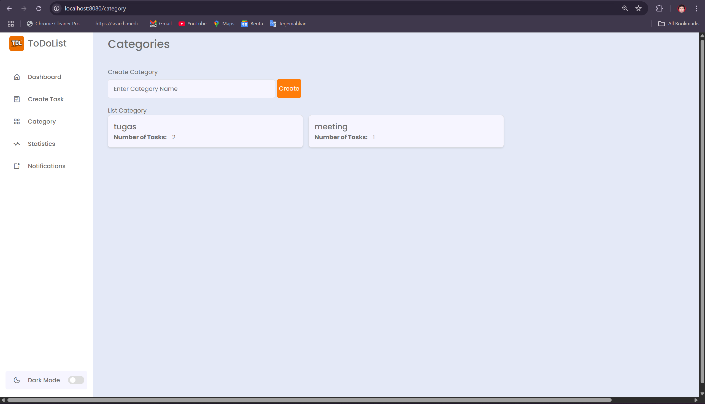

# ToDoList

Students today face an increasingly complex landscape of academic and personal responsibilities. With packed schedules, tight assignment deadlines, and multiple commitments including organizational activities, internships, and personal projects, effective time and task management has become a critical challenge that directly impacts their productivity, work-life balance, and academic performance. Despite the digital age we live in, many students continue to rely on traditional methods such as handwritten notes in physical planners or mental reminders. These conventional approaches prove inadequate for modern student needs, presenting several significant limitations such , as, Inefficiency, Limited accessibility, Lack of smart features, and many more.  

This TodoList web application addresses these challenges by providing a comprehensive, digital solution specifically designed for the modern student lifestyle. The platform combines intuitive task management with smart organizational features, creating an efficient system that adapts to users' dynamic schedules and evolving priorities.

<h2>🛠️ Architecture</h2>
<b>Backend Architecture: </b> java Spring Boot serves as the robust foundation for application logic management and data processing, providing enterprise-level reliability and scalability.

<b>Frontend Development:</b> A combination of HTML, Thymeleaf templating engine, CSS, and JavaScript creates a responsive and interactive user interface that adapts seamlessly across different devices and screen sizes.

<b>Database Management:</b> PostgreSQL hosted on Microsoft Azure ensures secure, scalable, and reliable data storage with enterprise-grade performance and backup capabilities.

<b>Hosting:</b> The entire application is deployed and hosted using Microsoft Azure, leveraging cloud computing benefits including high availability, automatic scaling, and global accessibility.

<h2>✨ Main Features</h2>

1. <b>Task Management</b>
  This feature allows users to easily add, edit, delete, and organize their task lists. With an intuitive interface, users can efficiently manage various daily tasks.

2. <b>Task Priority</b>
  Users can assign priority levels to each task, such as "High," "Medium," or "Low," to ensure focus on more urgent and important tasks.

3. <b>Tas Status</b>
  Tasks can be tracked based on their status: "Not Started," "On Progress," or "Completed," allowing users to monitor work progress more clearly.

4. <b>Deadline Reminders</b>
  The system automatically sends notifications to users to remind them of tasks approaching their completion deadlines, helping users avoid missing important due dates.

5. <b>Task Categories</b>
  This feature enables users to group tasks into various categories such as academic, organizational, personal, or others, making task management more organized.

6. <b>Performance Statistics</b>
  Users can view statistics displaying the number of completed, ongoing, and not-started tasks, providing a clear overview of their productivity.

7. <b>Timeline Visualization</b>
  This feature presents task schedules in a structured timeline format, allowing users to visualize their work plans chronologically.

8. <b> Dark Mode</b>
  Users can activate dark mode to change the application's appearance to darker colors, providing visual comfort when used in low-light environments.

<h2>📸 Screenshots</h2>

